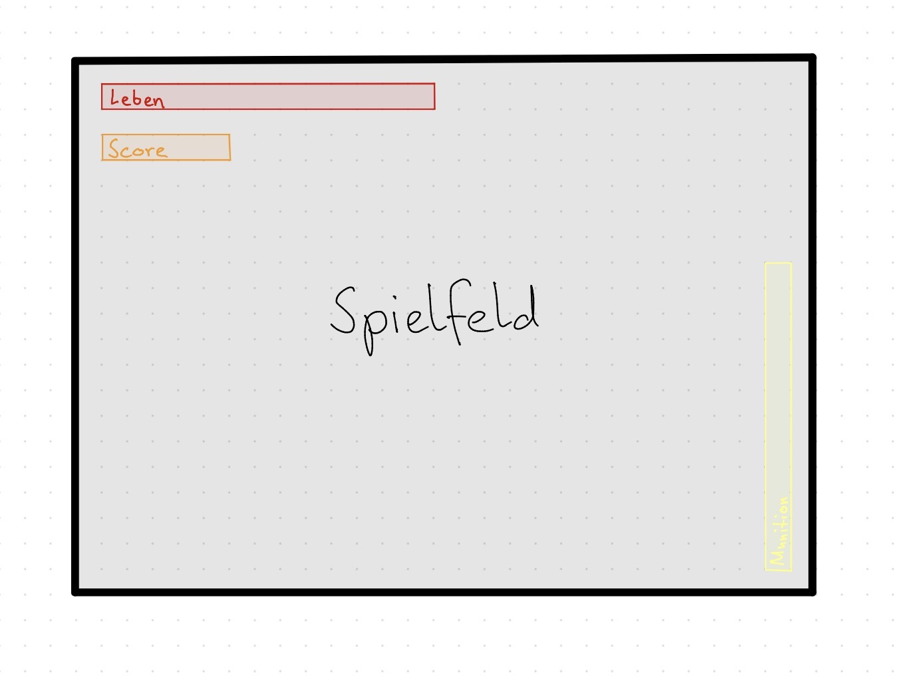
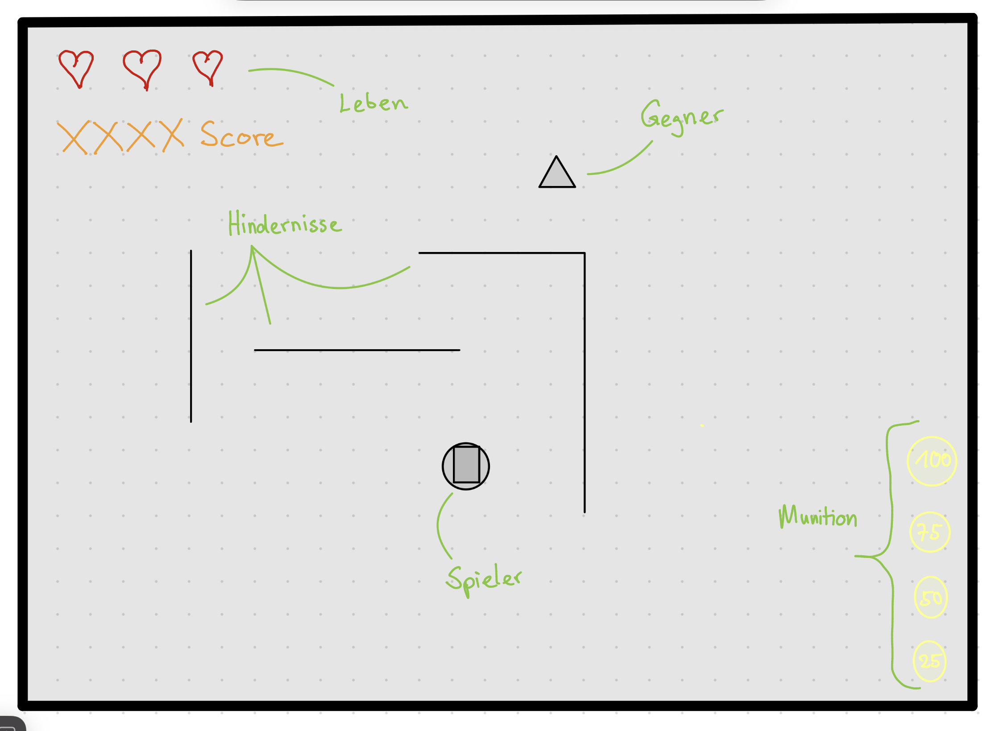

# Game Design Document TD-Shooter

## Inhaltsverzeichnis

1. [Grobspezifikation & Anforderungen](#1-grobspezifikation--anforderungen)\
  1.1[Spielüberblick](#11-spielüberblick)\
  1.2[Gameplay und Regeln](#12-gameplay-und-regeln)\
  1.3[Level und Content](#13-level-und-content)\
  1.4[Benutzeroberfläche (UI/UX)](#14-benutzeroberfläche-uiux)\
  1.5[Technisches Konzept / Architektur](#15-technisches-konzept--architektur)\
  1.6[Nicht-funktionale Anforderungen](#16-nicht-funktionale-anforderungen)\
  1.7[Abnahmekriterien (Aus Sicht BA/AG)](#17-abnahmekriterien-aus-sicht-baag)
2. [Spiellogik](#2-spiellogik)\
  2.1[Gameplay Loop](#21-gameloop)\
  2.2[Entity](#22-entity)\
  2.3[Architektur](#23-software-architektur)

## 1. Grobspezifikation & Anforderungen

### 1.1 Spielüberblick

- **Genre**: Top-Down Shooter
- **Kernziel**: Das Erreichen einer möglichst hohen Punktzahl (Highscore).
- **Zielplattform**: Windows(PC)
- **Zielgruppe**: Jugendliche und junge Erwachsene

### 1.2 Gameplay und Regeln

- **Spielfigur**: Der Spieler steuert einen Charakter mit spezifischen Attributen wie Lebenspunkten (HP) und Bewegungsgeschwindigkeit.
- **Gegner**: Verschiedene Gegnertypen mit individuellem Verhalten (z. B. Verfolgung des Spielers, Fernkampf).
- **Steuerung**: Intuitive Tastatursteuerung für Bewegung, Schiessen und Pausieren des Spiels.
- **Punktesystem**: Punkte werden durch das Eliminieren von Gegnern gesammelt und in einem Highscore-System festgehalten.
- **Spielende**: Das Spiel endet, wenn die Lebenspunkte des Spielers auf Null sinken (Game Over). Danach besteht die Möglichkeit zum Neustart.

### 1.3 Level und Content

- **Anzahl Level (MVP)**: 2
- **Levelaufbau**:
  - **Dimensionen**:1280 x 700 Einheiten (Pixel)
  - **Layout**:Komplexes Terrain mit zahlreichen Hindernissen.
- **Schwierigkeitsgrad**: Die Schwierigkeit skaliert dynamisch mit der erreichten Punktzahl.

### 1.4 Benutzeroberfläche (UI/UX)

- **Hauptscreen (HUD)**:
  - **Spielfeld**: Zentrale Darstellung von Spieler und Gegnern.
  - **Anzeigen**: Echtzeit-Anzeige von Lebenspunkten, aktuellem Score und verstrichener Zeit.
- **Menüs**: Start- und Endbildschirm mit Optionen zum Spielstart, zur Steuerungserklärung und zum Beenden des Programms.
- *Siehe Dokument*: `./docs/skizze_benutzeroberfläche.jpg`

### 1.5 Technisches Konzept / Architektur

- **Technologie**: Python (aktuelle Version) unter Verwendung der Pygame-Library.
- **Kernmodule**:
  - Game Loop (Hauptschleife)
  - Player-Klasse
  - Enemy-Klasse (Gegner-KI)
  - Projectile-Klasse (Projektil-Logik)
  - Level/Map-Management

### 1.6 Nicht-funktionale Anforderungen

- **Performance**: Flüssige Darstellung von mindestens 50 gleichzeitigen Gegnern.
- **Bedienbarkeit**: Optimiert für Windows-Systeme.
- **Hardware-Anforderungen**: Lauffähig auf gängiger Mid-Range-Hardware (CPU/GPU).

### 1.7 Abnahmekriterien (Aus Sicht BA/AG)

- Das Spiel ist vollständig spielbar, bis der Spieler alle Lebenspunkte verliert.
- Die Spielfigur lässt sich präzise in vier (oder acht) Richtungen steuern.
- Mindestens zwei Level sind komplett integriert und spielbar.
- Der Score wird korrekt berechnet und bleibt nach dem "Game Over" sichtbar.
- Das Spiel wird als eigenständige `.exe`-Datei ausgeliefert.

## 2. Spiellogik

### 2.1 Gameloop

Der Kern des Spiels besteht aus dem Überlebenskampf gegen kontinuierlich spawnende Gegnerwellen. Durch das Eliminieren von Gegnern erhält der Spieler jeweils einen Punkt (+1 Score). Das Ziel ist es, so lange wie möglich zu überleben und dabei mindestens Level 2 zu erreichen.

### 2.2 Entity

#### Spieler

- **Leben**: Maximal 3 Lebenspunkte.
- **Munition**: Begrenztes Magazin; erfordert automatisches oder manuelles Nachladen per Tastendruck.
- **Score**: Akkumulierte Punkte durch besiegte Gegner.
- **Waffe**: Eine Fernkampfwaffe (Projektilbasis).

#### Gegner

- **Skalierung**: Mit steigendem Score erhöhen sich die Geschwindigkeit und die Schwierigkeit der Gegner.
- **Leben**: Startwert beträgt 1 HP.
- **Nahkampfschaden**: Bei physischem Kontakt mit dem Spieler verliert dieser Lebenspunkte.
- **Bewegung**: Gegner verfolgen den Spieler aktiv auf der Karte.
- **Spawn-System**: Gegner erscheinen an den Kartenrändern, jedoch außerhalb eines Sicherheitsradius um den Spieler.

#### Projektile (Schüsse)

- Kleine Projektile, die bei Kollision Schaden verursachen.
- **Kollisionsverhalten:**
  - **Hindernisse**: Das Projektil wird bei Kontakt mit der Umgebung zerstört.
  - **Gegner**: Das Projektil fügt dem Gegner Schaden zu und wird meist zerstört.

#### Umgebung

Die Karten werden manuell erstellt und enthalten statische Hindernisse, die weder von Spielern noch von Gegnern oder Projektilen passiert werden können.

##### Level 1

Wenige Hindernisse; dient als Tutorial zur Einführung in die Steuerung und Mechaniken.

##### Level 2

Erhöhte Komplexität durch viele Hindernisse und Sackgassen, um den Spieler strategisch zu fordern.

### 2.2 Benutzeroberfläche (Details)

Das HUD besteht aus vier Kernelementen:

1. **Lebensanzeige**: Horizontal am oberen linken Bildschirmrand.
2. **Score**: Direkt unter der Lebensanzeige.
3. **Munitionsanzeige**: Vertikaler Balken in der unteren rechten Ecke.
4. **Spielfeld**: Zentraler Bereich für die Action.

### 2.3 Software-Architektur

Das Spiel folgt dem EVA-Prinzip (Eingabe, Verarbeitung, Ausgabe) und nutzt eine klassenbasierte Struktur:

- **Game-Klasse (Controller)**: Zentrales Management des Main-Loops, des Event-Handlings (Input) und der Level-Übergänge.
- **Sprite-System**: Nutzung von `pygame.sprite.Sprite` für:
  - `Player`: Inklusive HP-Management und Bewegungslogik.
  - `Enemy`: Inklusive Pathfinding/KI und Schadenslogik.
  - `Projectile`: Berechnung der Flugbahn und Kollisionsabfrage.
- **Level-Manager**: Verantwortlich für das Laden der Map-Daten (Kollisionsmatrix) und das Instanziieren der Entities.
- **UI-Manager**: Rendering des HUDs als Overlay über dem Spielgeschehen.
